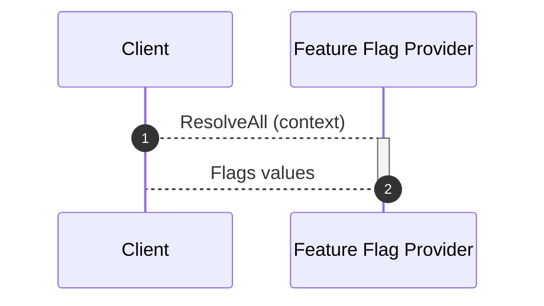

<!-- markdownlint-disable MD033 -->
<!-- x-hide-in-docs-start -->
<p align="center">
  <picture>
    <source media="(prefers-color-scheme: dark)" srcset="https://raw.githubusercontent.com/open-feature/community/0e23508c163a6a1ac8c0ced3e4bd78faafe627c7/assets/logo/horizontal/white/openfeature-horizontal-white.svg" />
    
  </picture>
</p>

<h2 align="center">OpenFeature Web SDK</h2>

<!-- x-hide-in-docs-end -->
<!-- The 'github-badges' class is used in the docs -->
<p align="center" class="github-badges">
  <a href="https://github.com/open-feature/spec/releases/tag/v0.8.0">
    
  </a>
  <!-- x-release-please-start-version -->
  <a href="https://github.com/open-feature/js-sdk/releases/tag/web-sdk-v1.7.2">
    
  </a>
  <!-- x-release-please-end -->
  <br/>
  <a href="https://open-feature.github.io/js-sdk/modules/_openfeature_web_sdk.html">
    
  </a>
  <a href="https://www.npmjs.com/package/@openfeature/web-sdk">
    
  </a>
  <a href="https://codecov.io/gh/open-feature/js-sdk">
    
  </a>
    <a href="https://bestpractices.coreinfrastructure.org/projects/6594">
    
  </a>
</p>
<!-- x-hide-in-docs-start -->

[OpenFeature](https://openfeature.dev) is an open specification that provides a vendor-agnostic, community-driven API for feature flagging that works with your favorite feature flag management tool or in-house solution.

<!-- x-hide-in-docs-end -->

## 🚀 Quick start

### Requirements

- ES2015-compatible web browser (Chrome, Edge, Firefox, etc)

### Install

#### npm

```sh
npm install --save @openfeature/web-sdk
```

> [!TIP]
> This SDK is designed to run in the browser. If you're interested in server support, check out the [Node.js SDK](https://openfeature.dev/docs/reference/technologies/server/javascript/).

#### yarn

```sh
# yarn requires manual installation of the @openfeature/core peer-dependency
yarn add @openfeature/web-sdk @openfeature/core
```

> [!NOTE]
> `@openfeature/core` contains common components used by all OpenFeature JavaScript implementations.
> Every SDK version has a requirement on a single, specific version of this dependency.
> For more information, and similar implications on libraries developed with OpenFeature see [considerations when extending](#considerations).

### Usage

```ts
import { OpenFeature } from '@openfeature/web-sdk';

// Register your feature flag provider
try {
  await OpenFeature.setProviderAndWait(new YourProviderOfChoice());
} catch (error) {
  console.error('Failed to initialize provider:', error);
}

// create a new client
const client = OpenFeature.getClient();

// Evaluate your feature flag
const v2Enabled = client.getBooleanValue('v2_enabled', false);

if (v2Enabled) {
  console.log("v2 is enabled");
}
```

### API Reference

See [here](https://open-feature.github.io/js-sdk/modules/_openfeature_web_sdk.html) for the complete API documentation.

## 🌟 Features

| Status | Features                            | Description                                                                                                                        |
| ------ | ----------------------------------- | ---------------------------------------------------------------------------------------------------------------------------------- |
| ✅      | [Providers](#providers)             | Integrate with a commercial, open source, or in-house feature management tool.                                                     |
| ✅      | [Targeting](#targeting-and-context) | Contextually-aware flag evaluation using [evaluation context](https://openfeature.dev/docs/reference/concepts/evaluation-context). |
| ✅      | [Hooks](#hooks)                     | Add functionality to various stages of the flag evaluation life-cycle.                                                             |
| ✅      | [Logging](#logging)                 | Integrate with popular logging packages.                                                                                           |
| ✅      | [Domains](#domains)                 | Logically bind clients with providers.                                                                                             |
| ✅      | [Eventing](#eventing)               | React to state changes in the provider or flag management system.                                                                  |
| ✅      | [Tracking](#tracking)               | Associate user actions with feature flag evaluations, particularly for A/B testing.                                                |
| ✅      | [Shutdown](#shutdown)               | Gracefully clean up a provider during application shutdown.                                                                        |
| ✅      | [Extending](#extending)             | Extend OpenFeature with custom providers and hooks.                                                                                |
| ✅      | [Multi-Provider](#multi-provider)   | Combine multiple providers with configurable evaluation strategies.                                                                |

<sub>Implemented: ✅ | In-progress: ⚠️ | Not implemented yet: ❌</sub>

### Providers

[Providers](https://openfeature.dev/docs/reference/concepts/provider) are an abstraction between a flag management system and the OpenFeature SDK.
Look [here](https://openfeature.dev/ecosystem/?instant_search%5BrefinementList%5D%5Btype%5D%5B0%5D=Provider&instant_search%5BrefinementList%5D%5Bcategory%5D%5B0%5D=Client-side&instant_search%5BrefinementList%5D%5Btechnology%5D%5B0%5D=JavaScript) for a complete list of available providers.
If the provider you're looking for hasn't been created yet, see the [develop a provider](#develop-a-provider) section to learn how to build it yourself.

Once you've added a provider as a dependency, it can be registered with OpenFeature like this:

#### Awaitable

To register a provider and ensure it is ready before further actions are taken, you can use the `setProviderAndWait` method as shown below:

```ts
try {
  await OpenFeature.setProviderAndWait(new MyProvider());
} catch (error) {
  console.error('Failed to initialize provider:', error);
}
```

#### Synchronous

To register a provider in a synchronous manner, you can use the `setProvider` method as shown below:

```ts
OpenFeature.setProvider(new MyProvider());
```

Once the provider has been registered, the status can be tracked using [events](#eventing).

In some situations, it may be beneficial to register multiple providers in the same application.
This is possible using [domains](#domains), which is covered in more detail below.

#### Multi-Provider

The Multi-Provider allows you to use multiple underlying providers as sources of flag data for the OpenFeature web SDK. When a flag is being evaluated, the Multi-Provider will consult each underlying provider it is managing in order to determine the final result. Different evaluation strategies can be defined to control which providers get evaluated and which result is used.

The Multi-Provider is a powerful tool for performing migrations between flag providers, or combining multiple providers into a single feature flagging interface. For example:

- **Migration**: When migrating between two providers, you can run both in parallel under a unified flagging interface. As flags are added to the new provider, the Multi-Provider will automatically find and return them, falling back to the old provider if the new provider does not have the flag.
- **Multiple Data Sources**: The Multi-Provider allows you to seamlessly combine many sources of flagging data, such as environment variables, local files, database values and SaaS hosted feature management systems.

```ts
import { MultiProvider } from '@openfeature/web-sdk';

const multiProvider = new MultiProvider([
  { provider: new ProviderA() },
  { provider: new ProviderB() }
]);

await OpenFeature.setProviderAndWait(multiProvider);

const client = OpenFeature.getClient();
console.log(client.getBooleanDetails("my-flag", false));
```

By default, the Multi-Provider will evaluate all underlying providers in order and return the first successful result. If a provider indicates it does not have a flag (FLAG_NOT_FOUND error code), then it will be skipped and the next provider will be evaluated.

##### Evaluation Strategies

The Multi-Provider comes with three strategies out of the box:

- **FirstMatchStrategy** (default): Evaluates all providers in order and returns the first successful result. Providers that indicate FLAG_NOT_FOUND error will be skipped and the next provider will be evaluated.
- **FirstSuccessfulStrategy**: Evaluates all providers in order and returns the first successful result. Any error will cause that provider to be skipped.
- **ComparisonStrategy**: Evaluates all providers sequentially. If every provider returns a successful result with the same value, then that result is returned. Otherwise, the result returned by the configured "fallback provider" will be used.

```ts
import { MultiProvider, FirstSuccessfulStrategy } from '@openfeature/web-sdk';

const multiProvider = new MultiProvider(
  [
    { provider: new ProviderA() },
    { provider: new ProviderB() }
  ], 
  new FirstSuccessfulStrategy()
);
```

##### Tracking Support

The Multi-Provider supports tracking events across multiple providers, allowing you to send analytics events to all configured providers simultaneously:

```ts
// Tracked events will be sent to all providers by default
client.track('user-conversion', { 
  value: 99.99, 
  currency: 'USD' 
});
```

### Flag evaluation flow

When a new provider is added to OpenFeature client the following process happens:



In (1) the Client sends a request to the provider backend in order to get all values from all feature flags that it has.
Once the provider backend replies (2) the client holds all flag values and therefore the flag evaluation process is synchronous.

In order to prevent flag evaluations from defaulting while the provider is initializing, it is highly recommended to evaluate flags only after the provider is ready. This can be done using the `setProviderAndWait` method or using the `setProvider` method and listening for the `READY` [event](#eventing).

### Targeting and Context

Sometimes, the value of a flag must consider some dynamic criteria about the application or user, such as the user's location, IP, email address, or the server's location.
In OpenFeature, we refer to this as [targeting](https://openfeature.dev/specification/glossary#targeting).
If the flag management system you're using supports targeting, you can provide the input data using the [evaluation context](https://openfeature.dev/docs/reference/concepts/evaluation-context).

```ts
// Sets global context during provider registration
await OpenFeature.setProvider(new MyProvider(), { origin: document.location.host });
```

Change context after the provider has been registered using `setContext`.

```ts
// Set a value to the global context
await OpenFeature.setContext({ targetingKey: localStorage.getItem("targetingKey") });
```

Context is global and setting it is `async`.
Providers may implement an `onContextChange` method that receives the old and newer contexts.
Given a context change, providers can use this method internally to detect if the flag values cached on the client are still valid.
If needed, a request will be made to the provider with the new context in order to get the correct flag values.

### Hooks

[Hooks](https://openfeature.dev/docs/reference/concepts/hooks) allow for custom logic to be added at well-defined points of the flag evaluation life-cycle.
Look [here](https://openfeature.dev/ecosystem/?instant_search%5BrefinementList%5D%5Btype%5D%5B0%5D=Hook&instant_search%5BrefinementList%5D%5Bcategory%5D%5B0%5D=Client-side&instant_search%5BrefinementList%5D%5Btechnology%5D%5B0%5D=JavaScript) for a complete list of available hooks.
If the hook you're looking for hasn't been created yet, see the [develop a hook](#develop-a-hook) section to learn how to build it yourself.

Once you've added a hook as a dependency, it can be registered at the global, client, or flag invocation level.

```ts
import { OpenFeature } from "@openfeature/web-sdk";

// add a hook globally, to run on all evaluations
OpenFeature.addHooks(new ExampleGlobalHook());

// add a hook on this client, to run on all evaluations made by this client
const client = OpenFeature.getClient();
client.addHooks(new ExampleClientHook());

// add a hook for this evaluation only
const boolValue = client.getBooleanValue("bool-flag", false, { hooks: [new ExampleHook()]});
```

### Logging

The Web SDK will log warnings and errors to the console by default.
This behavior can be overridden by passing a custom logger either globally or per client.
A custom logger must implement the [Logger interface](../shared/src/logger/logger.ts).

```ts
import type { Logger } from "@openfeature/web-sdk";

// The logger can be anything that conforms with the Logger interface
const logger: Logger = console;

// Sets a global logger
OpenFeature.setLogger(logger);

// Sets a client logger
const client = OpenFeature.getClient();
client.setLogger(logger);
```

### Domains

Clients can be assigned to a domain.
A domain is a logical identifier which can be used to associate clients with a particular provider.
If a domain has no associated provider, the default provider is used.

```ts
import { OpenFeature, InMemoryProvider } from "@openfeature/web-sdk";

// Registering the default provider
OpenFeature.setProvider(InMemoryProvider(myFlags));
// Registering a provider to a domain
OpenFeature.setProvider("my-domain", new InMemoryProvider(someOtherFlags));

// A Client bound to the default provider
const clientWithDefault = OpenFeature.getClient();
// A Client bound to the InMemoryProvider provider
const domainScopedClient = OpenFeature.getClient("my-domain");
```

Domains can be defined on a provider during registration.
For more details, please refer to the [providers](#providers) section.

#### Manage evaluation context for domains

By default, domain-scoped clients use the global context.
This can be overridden by explicitly setting context when registering the provider or by referencing the domain when updating context:

```ts
OpenFeature.setProvider("my-domain", new NewCachedProvider(), { targetingKey: localStorage.getItem("targetingKey") });
```

To change context after the provider has been registered, use `setContext` with a domain:

```ts
await OpenFeature.setContext("my-domain", { targetingKey: localStorage.getItem("targetingKey") })
```

Once a domain's context has been defined, it will override the global context for all clients bound to the domain.
Context can be cleared for a domain by calling `OpenFeature.clearContext("my-domain")` or `OpenFeature.clearContexts()` to reset all context.

### Eventing

Events allow you to react to state changes in the provider or underlying flag management system, such as flag definition changes, provider readiness, or error conditions.
Initialization events (`PROVIDER_READY` on success, `PROVIDER_ERROR` on failure) are dispatched for every provider.
Some providers support additional events, such as `PROVIDER_CONFIGURATION_CHANGED`.

Please refer to the documentation of the provider you're using to see what events are supported.

```ts
import { OpenFeature, ProviderEvents } from '@openfeature/web-sdk';

// OpenFeature API
OpenFeature.addHandler(ProviderEvents.Ready, (eventDetails) => {
  console.log(`Ready event from: ${eventDetails?.providerName}:`, eventDetails);
});

// Specific client
const client = OpenFeature.getClient();
client.addHandler(ProviderEvents.Error, (eventDetails) => {
  console.log(`Error event from: ${eventDetails?.providerName}:`, eventDetails);
});
```

### Tracking

The tracking API allows you to use OpenFeature abstractions and objects to associate user actions with feature flag evaluations.
This is essential for robust experimentation powered by feature flags.
For example, a flag enhancing the appearance of a UI component might drive user engagement to a new feature; to test this hypothesis, telemetry collected by a [hook](#hooks) or [provider](#providers) can be associated with telemetry reported in the client's `track` function.

```ts
// flag is evaluated
client.getBooleanValue('new-feature', false);

// new feature is used and track function is called recording the usage
useNewFeature();
client.track('new-feature-used');
```

### Shutdown

The OpenFeature API provides a close function to perform a cleanup of all registered providers.
This should only be called when your application is in the process of shutting down.

```ts
import { OpenFeature } from '@openfeature/web-sdk';

await OpenFeature.close()
```

## Extending

### Develop a provider

To develop a provider, you need to create a new project and include the OpenFeature SDK as a dependency.
This can be a new repository or included in [the existing contrib repository](https://github.com/open-feature/js-sdk-contrib) available under the OpenFeature organization.
You’ll then need to write the provider by implementing the [Provider interface](./src/provider/provider.ts) exported by the OpenFeature SDK.

```ts
import {
  AnyProviderEvent,
  EvaluationContext,
  Hook,
  JsonValue,
  Logger,
  Provider,
  ProviderEventEmitter,
  ResolutionDetails
} from '@openfeature/web-sdk';

// implement the provider interface
class MyProvider implements Provider {
  // Adds runtime validation that the provider is used with the expected SDK
  public readonly runsOn = 'client';
  readonly metadata = {
    name: 'My Provider',
  } as const;
  // Optional provider managed hooks
  hooks?: Hook[];
  resolveBooleanEvaluation(flagKey: string, defaultValue: boolean, context: EvaluationContext, logger: Logger): ResolutionDetails<boolean> {
    // code to evaluate a boolean
  }
  resolveStringEvaluation(flagKey: string, defaultValue: string, context: EvaluationContext, logger: Logger): ResolutionDetails<string> {
    // code to evaluate a string
  }
  resolveNumberEvaluation(flagKey: string, defaultValue: number, context: EvaluationContext, logger: Logger): ResolutionDetails<number> {
    // code to evaluate a number
  }
  resolveObjectEvaluation<T extends JsonValue>(flagKey: string, defaultValue: T, context: EvaluationContext, logger: Logger): ResolutionDetails<T> {
    // code to evaluate an object
  }

  onContextChange?(oldContext: EvaluationContext, newContext: EvaluationContext): Promise<void> {
    // reconcile the provider's cached flags, if applicable
  }

  // implement with "new OpenFeatureEventEmitter()", and use "emit()" to emit events
  events?: ProviderEventEmitter<AnyProviderEvent> | undefined;

  initialize?(context?: EvaluationContext | undefined): Promise<void> {
    // code to initialize your provider
  }
  onClose?(): Promise<void> {
    // code to shut down your provider
  }
}
```

> Built a new provider? [Let us know](https://github.com/open-feature/openfeature.dev/issues/new?assignees=&labels=provider&projects=&template=document-provider.yaml&title=%5BProvider%5D%3A+) so we can add it to the docs!

### Develop a hook

To develop a hook, you need to create a new project and include the OpenFeature SDK as a dependency.
This can be a new repository or included in [the existing contrib repository](https://github.com/open-feature/js-sdk-contrib) available under the OpenFeature organization.
Implement your own hook by conforming to the [Hook interface](../shared/src/hooks/hook.ts).

```ts
import type { Hook, HookContext, EvaluationDetails, FlagValue } from "@openfeature/web-sdk";

export class MyHook implements Hook {
  after(hookContext: HookContext, evaluationDetails: EvaluationDetails<FlagValue>) {
    // code that runs after flag values are successfully resolved from the provider
  }
}
```

> Built a new hook? [Let us know](https://github.com/open-feature/openfeature.dev/issues/new?assignees=&labels=hook&projects=&template=document-hook.yaml&title=%5BHook%5D%3A+) so we can add it to the docs!

### Considerations

When developing a library based on OpenFeature components, it's important to list the `@openfeature/web-sdk` as a `peerDependency` of your package.
This is a general best-practice when developing JavaScript libraries that have dependencies in common with their consuming application.
Failing to do this can result in multiple copies of the OpenFeature SDK in the consumer, which can lead to type errors, and broken singleton behavior.
The `@openfeature/core` package itself follows this pattern: the `@openfeature/web-sdk` has a peer dependency on `@openfeature/core`, and uses whatever copy of that module the consumer has installed (note that NPM installs peers automatically unless `--legacy-peer-deps` is set, while yarn does not, and PNPM does so based on its configuration).
When developing such libraries, it's NOT necessary to add a `peerDependency` on `@openfeature/core`, since the `@openfeature/web-sdk` establishes that dependency itself transitively.
